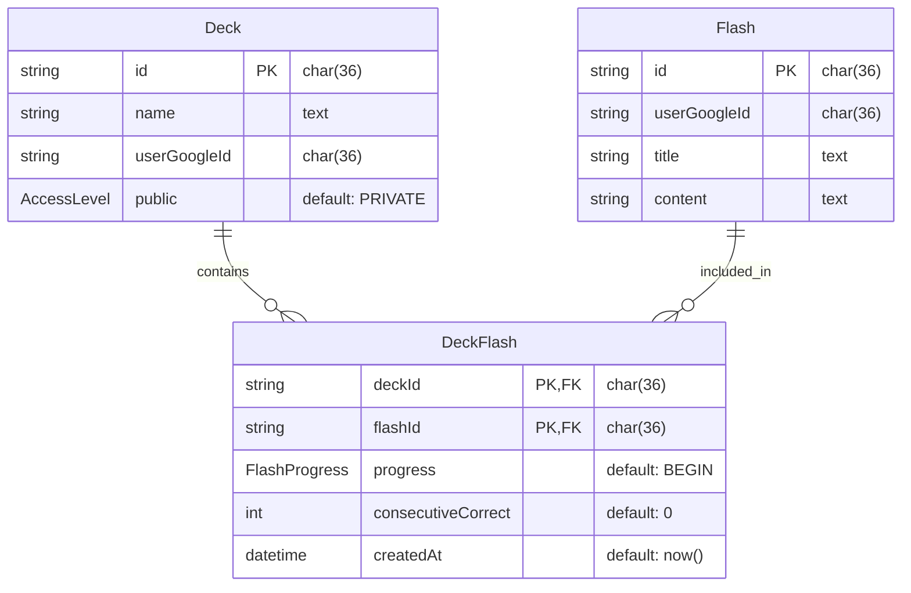

# README

## quick start

```sh
bun install
bunx prisma generate
bunx prisma generate --sql

```

## TODOs

- [x] add prisma
- [x] add users to the database
- [x] turn the user id into a string
- [x] add flashcards to the database
- [x] add next auth to trpc, turn the current end points to trpc end points

- [x] I need to add the flashcards to the decks

- [ ] instead of going directly into flashcard view for when clicking on a deck
      have a deck page that shows the deck details and progress

  - [ ] I need a way to delete decks
  - [ ] I need a way to remove flashcards from deck

what should the flashcard table look like?

| title | content | ...decks |

- [x] Have the use specify the deck(s) to add the
      new flash card into on creation.

  - [ ] ui selection
  - [ ] backend implementation

- [ ] if a flashcard is not in any decks delete the flashcard !
- [ ] fix the search on multi deck selection ! This I have to do
- [x] have the "know" and "don't know" buttons actually do shit
- [ ] add back mobile swiping
- [ ] fix the deck view on desktop
- [ ] I need to be able to update the visibility of decks
- [ ] make links that are shareable
- [ ] delete the User table and just use the information from google
- [ ] add auth check to every endpoint

# ERD


